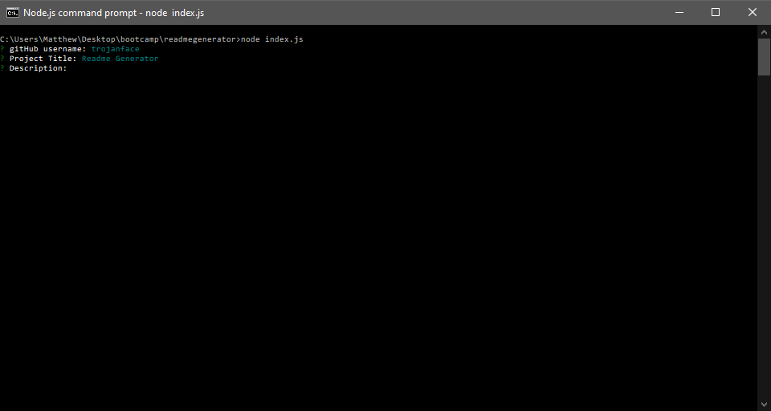

# Readme Generator
### By trojanface

## Description
A node script to assist with the creation of comprehensive readme files. By asking the user a series of questions it uses these answers tog enerate the contents of a readme.md file.

## Table of Contents

1. Description
2. Contents
3. Screenshot
4. Deployed
5. Installation
6. Usage
7. License
8. Contact
9. Address

## Installation
1. Must run a npm install to download inquirer package from npm.
2. You can then run the program with node.

## Usage
1. Run script with node. e.g. (node index.js)
2. Answer the questions.
3. Find the created README file in the folder where index.js runs.

## License
Personal Use

## Contact
email - trojanface@hotmail.com
